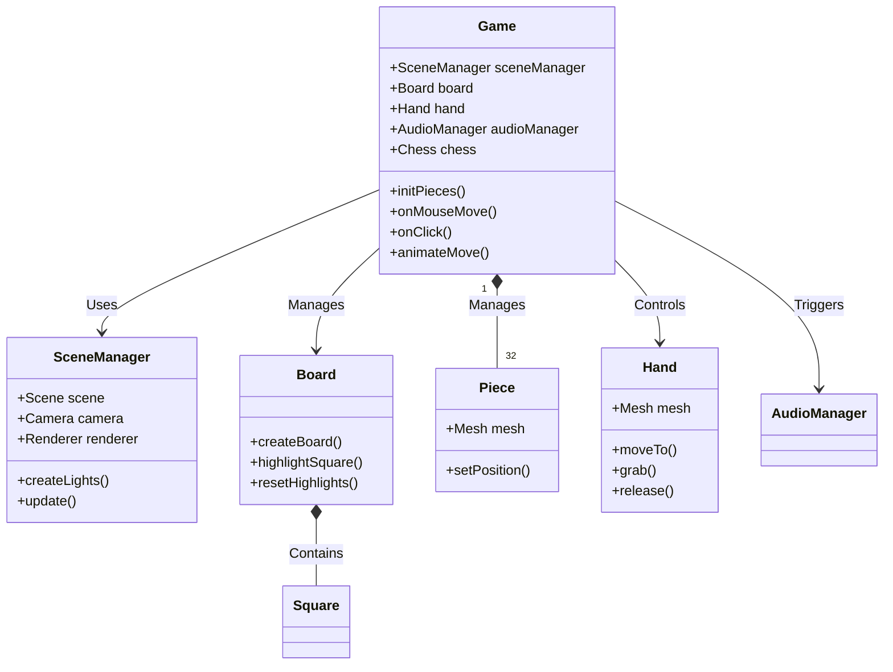
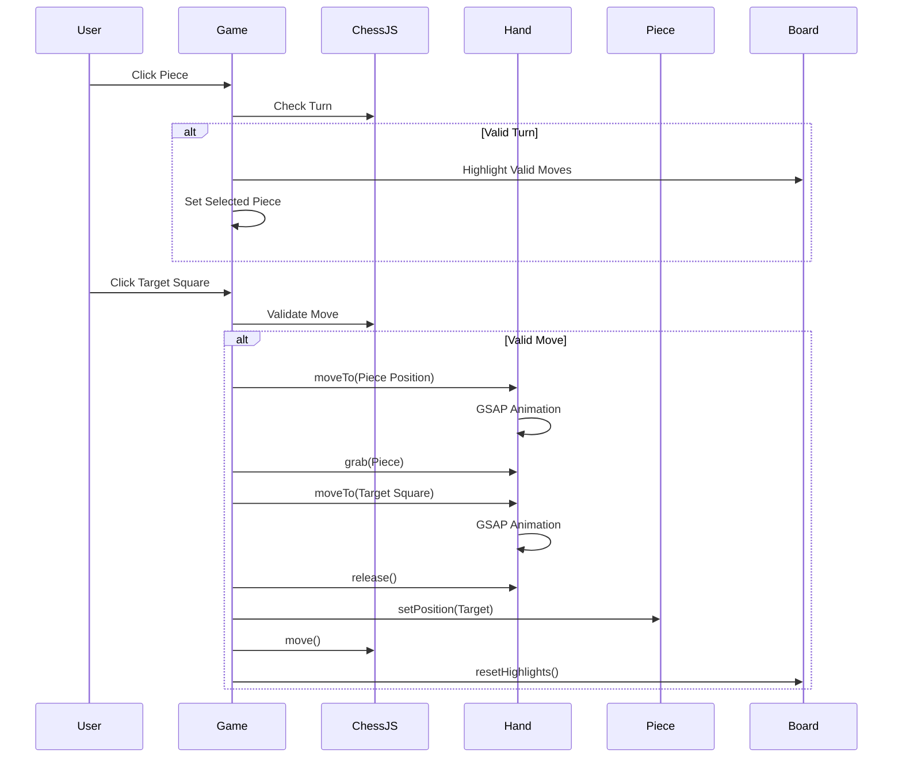

# Project Architecture

## Overview
This project is a 3D Chess Game built with **Vanilla JavaScript**, **Three.js** for 3D rendering, **GSAP** for animations, and **chess.js** for game logic. It features a stylized "Spider-Verse" / "Golden Hour" aesthetic with procedural materials and synthesized audio.

## Tech Stack
- **Three.js**: 3D Rendering Engine (Scene, Camera, Lights, Meshes).
- **GSAP**: Animation Library (Hand movement, smooth transitions).
- **Chess.js**: Chess Logic (Move validation, Game state).
- **Web Audio API**: Synthesized Sound Effects.
- **Vite**: Build Tool & Dev Server.

## Directory Structure
```
src/
├── main.js             # Entry point, initializes Game
├── Game.js             # Core Game Loop & Interaction Logic
├── SceneManager.js     # Three.js Scene Setup (Lights, Camera, Renderer)
├── Board.js            # Chess Board Generation & Highlighting
├── Piece.js            # Chess Piece Generation (LatheGeometry) & Materials
├── Hand.js             # 3D Hand Model & Animation Logic
├── AudioManager.js     # Sound Synthesis
└── TextureGenerator.js # Procedural Texture Generation (Canvas API)
```

## Core Components

### 1. Game (`Game.js`)
The central controller.
- **Responsibilities**:
  - Initializes all other components.
  - Manages the Game Loop (`render`).
  - Handles User Input (Raycasting for clicks/hover).
  - Integrates `chess.js` for logic.
  - Orchestrates moves: Validates move -> Animates Hand -> Updates Board State.

### 2. SceneManager (`SceneManager.js`)
Handles the 3D environment.
- **Responsibilities**:
  - Sets up `THREE.Scene`, `THREE.PerspectiveCamera`, `THREE.WebGLRenderer`.
  - Manages Lighting (Golden Hour Setup: Sun, Fill, Hemisphere).
  - Handles Window Resize.
  - Configures `OrbitControls`.

### 3. Board (`Board.js`)
Represents the physical board.
- **Responsibilities**:
  - Generates 64 squares using `THREE.BoxGeometry`.
  - Applies Procedural Wood Textures.
  - Handles **Highlighting** (Selected, Valid Move, Capture) via `emissive` material properties.

### 4. Piece (`Piece.js`)
Represents individual chess pieces.
- **Responsibilities**:
  - Generates geometry using `THREE.LatheGeometry` based on profiles.
  - Applies Procedural Materials (Marble for White, Wood for Black).

### 5. Hand (`Hand.js`)
The interactive element for moving pieces.
- **Responsibilities**:
  - Creates a stylized robotic/gloved hand mesh.
  - Provides `moveTo`, `grab`, `release` methods using **GSAP** for smooth animation.

## Architecture Diagrams

### Class Relationship Diagram


### Move Sequence Diagram

