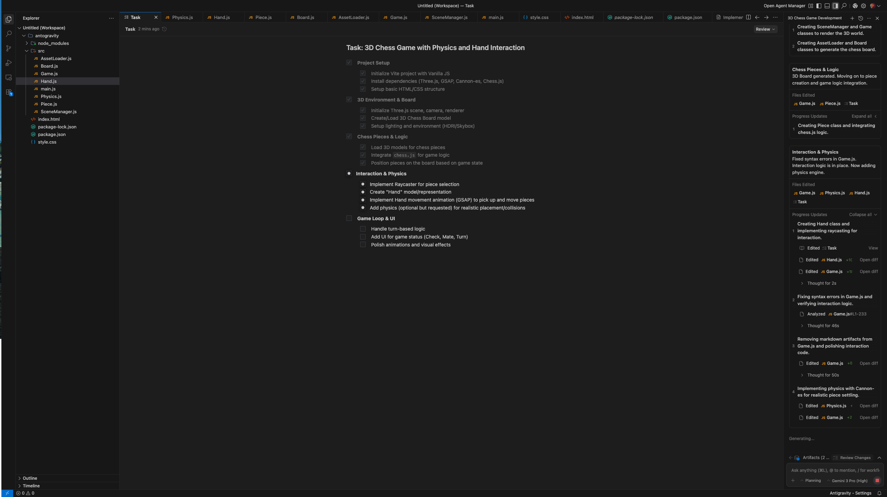

# Chess Levitate ♟️✨

A visually stunning, interactive 3D Chess game built with **Three.js** and **Vanilla JavaScript**. This project features a unique "Golden Hour" aesthetic, procedural materials, and a physics-inspired hand interaction model.

 
*(Note: Replace with an actual screenshot of your game)*

## ✨ Features

-   **Immersive 3D Environment**: Built with Three.js, featuring "Golden Hour" lighting and a starfield background.
-   **Interactive Gameplay**: Move pieces using a stylized 3D hand with smooth GSAP animations.
-   **Procedural Materials**:
    -   **White Pieces**: Polished White Marble with procedural veining.
    -   **Black Pieces**: Dark Wood with procedural grain.
    -   **Hand**: Metallic White Wood with an orange tint.
-   **Dynamic Board**: Light and Dark wood procedural textures with highlighting for valid moves and captures.
-   **Audio**: Synthesized sound effects for selection, moves, and captures.
-   **Chess Logic**: Powered by `chess.js` for accurate move validation and game state management.

## 🛠️ Tech Stack

-   **[Three.js](https://threejs.org/)**: 3D Rendering Engine.
-   **[GSAP](https://greensock.com/gsap/)**: Animation Library.
-   **[Chess.js](https://github.com/jhlywa/chess.js)**: Chess Logic.
-   **[Vite](https://vitejs.dev/)**: Next Generation Frontend Tooling.
-   **Vanilla JavaScript**: Core logic.

## 🚀 Getting Started

### Prerequisites

-   Node.js (v14 or higher)
-   npm (v6 or higher)

### Installation

1.  **Clone the repository**
    ```bash
    git clone https://github.com/yourusername/antigravity-chess.git
    cd antigravity-chess
    ```

2.  **Install dependencies**
    ```bash
    npm install
    ```

3.  **Run the development server**
    ```bash
    npm run dev
    ```
    Open `http://localhost:5173` in your browser.

## 🎮 How to Play

1.  **Select a Piece**: Click on a piece to select it. Valid moves will be highlighted in **Yellow**, and capture targets in **Red**.
2.  **Move**: Click on a highlighted square to move the piece. The 3D hand will pick up and place the piece.
3.  **Controls**:
    -   **Left Click**: Select/Move.
    -   **Right Click / Drag**: Rotate the camera.
    -   **Scroll**: Zoom in/out.
    -   **Reset**: Click the "Reset Game" button in the top right to start over.

## 📂 Project Structure

Please refer to [ARCHITECTURE.md](./ARCHITECTURE.md) for a detailed breakdown of the project's architecture, class structure, and flow diagrams.

## 🤝 Contributing

Contributions are welcome! Please read our [Contributing Guidelines](./CONTRIBUTING.md) for details on our code of conduct, and the process for submitting pull requests.

## 📄 License

This project is licensed under the MIT License - see the [LICENSE](./LICENSE) file for details.

## 🙏 Acknowledgments

-   Inspired by the visual style of *Spider-Man: Into the Spider-Verse*.
-   Chess logic provided by `chess.js`.
